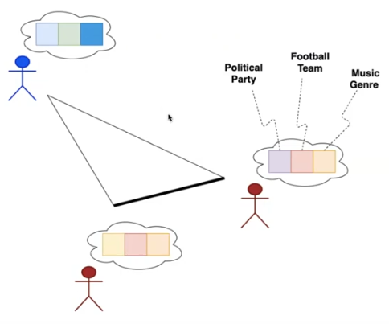
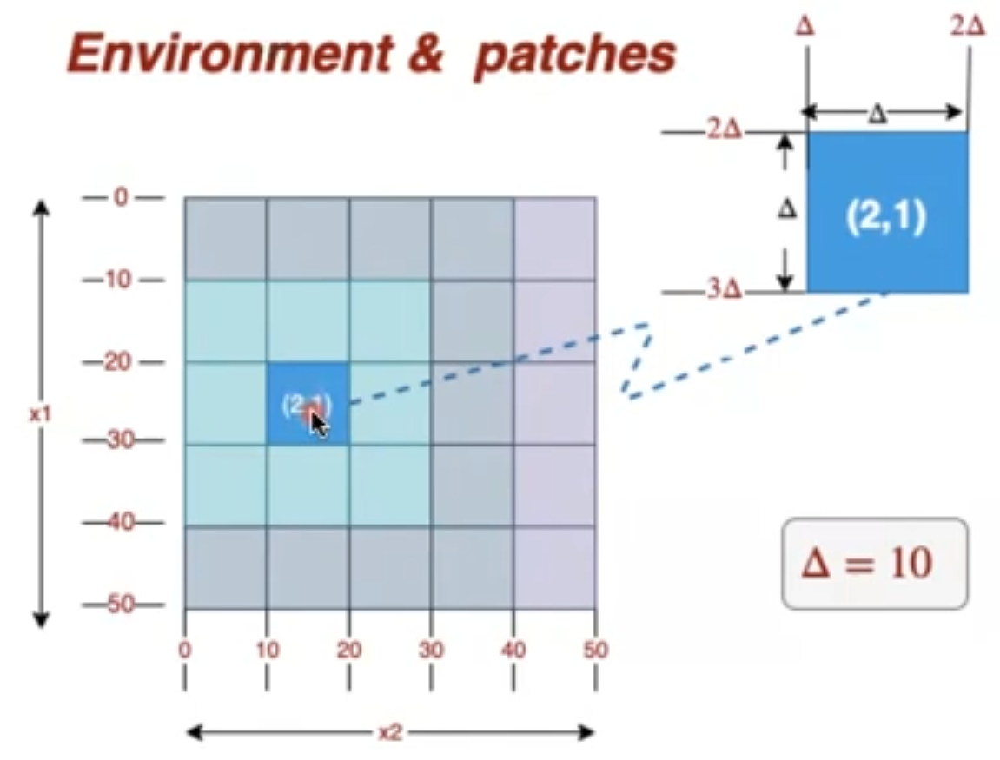
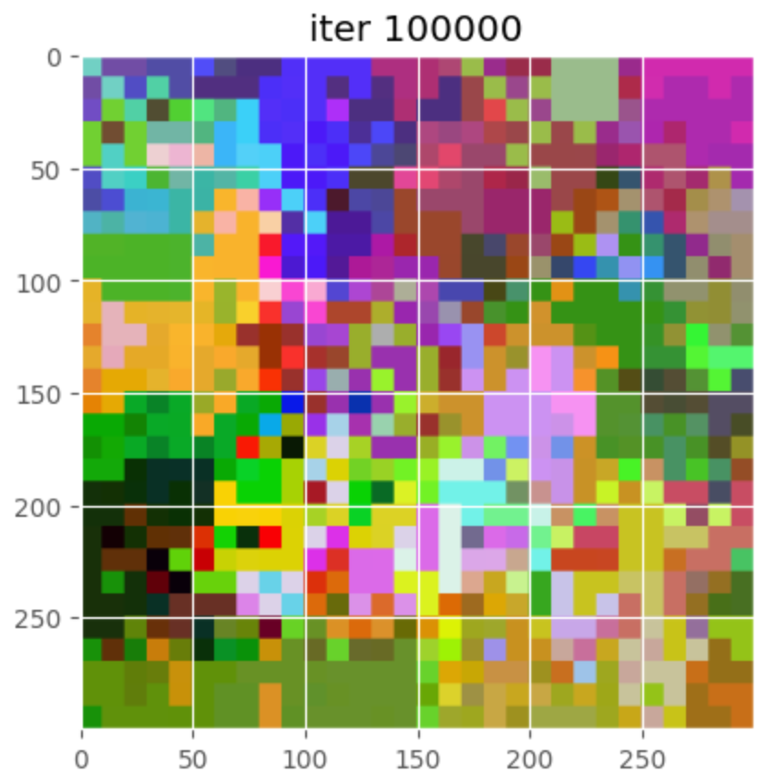
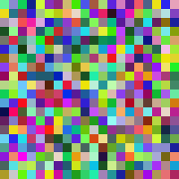

# Culture Model

> Ideas spread like disease

This Agent-based model is based on **Axelrod's model of dissemination of culture**

Axelrod (1997) uses the word 'culture' to denote "the set of individual attributes that are subject to social influence". He argues that culture "is something people learn from each other", and hence something that evolves through social influence. To study the process of cultural diffusion Axelrod builds a model based on two simple assumptions:
1. People are more likely to interact with others who share many of their cultural attributes
2. These interactions tend to increase the number of cultural attributes they share (thus making them more likely to interact again). 

## Interaction Network

People of similar interests, background, ideas or characteristics will often hang out together.

*Birds of a feater flock together*

## Similarity
- Geographic similarity: Nearby neighbors become similar
- Ideological similarity: People of similar interests become more similar

**RGB coloring** corresponds to 3 values for representing 3 interests of every agent.

## Environment

Environment is a grid of patches, each patch represents an agent.

## Rules

A time-step in the model is defined by the following activities:
- One agent k (active) is selected at random
- One of agent k's neighbours [1], denoted agent r (passive), is selected at random
- Agents k and r interact with probability equal to their cultural similarity nkr/f, where nkr denotes the number of cultural features for which agents k and r have the same trait. The interaction consists in that active agent k selects at random one of the f - nkr features on which the two agents differ, and copies the passive agent r's trait. In this way, agent k approaches agent r's cultural interests

## Culture model at step 100000

## Simulation process

